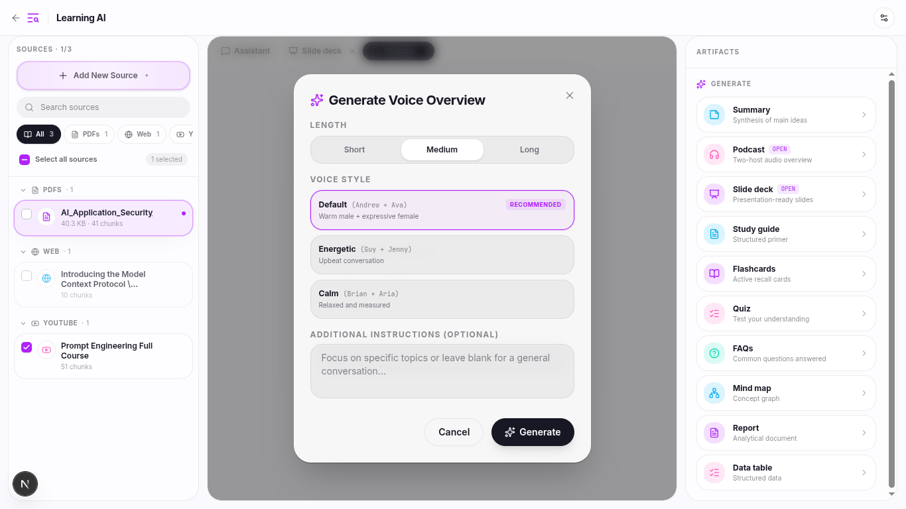
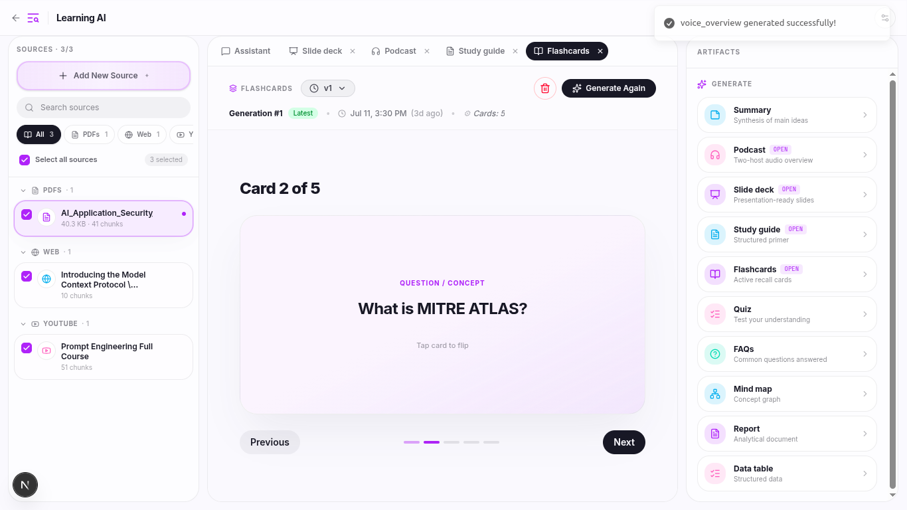

<!-- # 📚 DocContextly

<div align="center">

### AI-Powered Knowledge Workspace for Research & Learning

Transform documents, websites, YouTube videos, and notes into conversations, summaries, reports, slide decks, quizzes, study guides, flashcards, mind maps, and podcast-style voiceovers.

🚀 Inspired by Google NotebookLM


</div>

---

## 🚧 Project Status

> **Production deployment is currently in progress.**

DocContextly is actively being developed and improved. Core functionality is complete, and current efforts are focused on deployment, performance optimization, testing, and scalability improvements.

### Current Progress

- ✅ Multi-source ingestion
- ✅ AI-powered chat with RAG
- ✅ YouTube transcript extraction
- ✅ Website content extraction
- ✅ Source preview system
- ✅ Summary generation
- ✅ FAQ generation
- ✅ Quiz generation
- ✅ Flashcard generation
- ✅ Study Guide generation
- ✅ Mind Map generation
- ✅ Slide Deck generation
- ✅ Podcast-style Voiceover generation
- ✅ Redis + ARQ background workers
- ✅ Vector search with Qdrant
- 🔄 Production deployment
- 🔄 Performance optimization
- 🔄 End-to-end testing
- 🔄 User feedback iteration

---

# ✨ Overview

DocContextly is an AI-powered research and learning workspace that helps users organize information from multiple sources and transform it into useful learning materials.

Instead of switching between PDFs, websites, YouTube videos, notes, and AI tools, users can bring everything into a single notebook and interact with their knowledge through AI-powered chat and artifact generation.

Whether you're a student, researcher, educator, or professional, DocContextly helps you understand information faster and create study resources automatically.

---

# 🌟 Key Features

## 📂 Multi-Source Knowledge Base

Import information from multiple sources:

- PDF Documents
- DOCX Files
- CSV Files
- Markdown Files
- Text Files
- Websites
- Blog Articles
- YouTube Videos
- AI-generated Topic Research

### Source Upload


---

## 🌐 Topic-Based Research

Don't have resources?

Simply enter a topic and DocContextly will:

1. Search the web
2. Find relevant resources
3. Extract content
4. Build a notebook automatically

This enables rapid research and learning on any topic.

---

# 📖 Source Preview System

Every uploaded source can be previewed directly inside the application.

No need to download or open external applications.

---

## PDF Preview


---

## CSV Preview


---

## YouTube Video Preview

Includes embedded video playback and transcript extraction.


---

# 💬 AI Chat

Ask questions about your uploaded sources.

DocContextly uses Retrieval-Augmented Generation (RAG) to generate answers grounded in your documents.

Features:

- Source-grounded responses
- Multi-document conversations
- Source selection
- Context-aware retrieval
- Reduced hallucinations

### Chat Experience


---

# 🧠 AI Artifacts

Generate useful learning materials from your notebook.

Each artifact can be generated multiple times with different prompts and configurations.

---


## 📊 AI Slide Decks

Generate presentation-ready slides from your research materials.

Features:

- Multiple themes
- Responsive layouts
- Structured content
- Images and icons
- Presentation mode
- Export as pdf and pptx


---

## 🎙 Podcast-Style Voiceovers

Generate conversational audio overviews inspired by modern AI learning experiences.

Features:

- Multi-speaker dialogue
- AI-generated script
- Audio playback
- Source-grounded content

### Generated Voice Overview


### Voice Generation Interface



---


## 🧩 Mind Maps

Visualize concepts and relationships using AI-generated mind maps.


---


## 🎯 Quiz Generation

Convert learning materials into quizzes for self-assessment.


---

## 🗂 Flashcards

Generate study flashcards automatically.



---

## 📝 Summary Generation

Generate concise and detailed summaries from your sources.


---

## ❓ FAQ Generation

Automatically create frequently asked questions and answers.


---

## 📚 Study Guide

Create structured study materials from your documents.


---


# ⚡ Background Processing

Long-running AI tasks are processed asynchronously.

Users can continue interacting with the application while artifacts are being generated.

This significantly improves responsiveness and user experience.

Implemented using:

- Redis
- ARQ Workers
- Background Job Queue
- Retry Mechanisms
- Idempotent Jobs

---

# 🏗 Architecture

```text
                        ┌──────────────┐
                        │    User      │
                        └──────┬───────┘
                               │
                               ▼
                  ┌────────────────────────┐
                  │     Next.js Frontend    │
                  └──────────┬─────────────┘
                             │
                             ▼
                  ┌────────────────────────┐
                  │     FastAPI Backend     │
                  └──────────┬─────────────┘
                             │
        ┌────────────────────┼────────────────────┐
        ▼                    ▼                    ▼

┌───────────────┐  ┌────────────────┐  ┌────────────────┐
│ PostgreSQL    │  │ Redis + ARQ    │  │ Image Storage  │
│ Metadata DB   │  │ Background Jobs│  │ Source Assets  │
└───────────────┘  └────────────────┘  └────────────────┘
                             │
                             ▼

                  ┌────────────────────────┐
                  │    AI Processing Layer  │
                  └──────────┬─────────────┘
                             │
                             ▼

               ┌─────────────────────────────┐
               │ Qdrant Vector Database      │
               │ Embeddings + Semantic Search│
               └─────────────────────────────┘
```

---

# 🔄 How It Works

### 1. Add Sources

Upload files or import content from websites and YouTube.

### 2. Content Processing

The system extracts and cleans text content.

### 3. Chunking

Documents are split into manageable chunks.

### 4. Embedding Generation

Chunks are converted into vector embeddings.

### 5. Vector Storage

Embeddings are stored inside Qdrant.

### 6. Retrieval

Relevant chunks are retrieved based on user queries.

### 7. AI Generation

The LLM generates grounded responses and artifacts.

---

# 🛠 Tech Stack

## Frontend

- Next.js
- React
- TypeScript
- Tailwind CSS
- TanStack Query
- Shadcn UI
- Framer Motion

---

## Backend

- FastAPI
- Python
- SQLAlchemy
- Alembic
- PostgreSQL
- Pydantic

---

## AI & Machine Learning

- LangChain
- Retrieval-Augmented Generation (RAG)
- Hugging Face Embeddings
- Qdrant Vector Database
- Large Language Models

---

## Background Processing

- Redis
- ARQ

---

## Storage

- ImageKit
- Cloud Object Storage

---

# 🚀 Local Development Setup

## Clone Repository

```bash
git clone https://github.com/mrehanamjad/doccontextly.git

cd doccontextly
```

---

## Backend Setup

```bash
cd backend

python -m venv .venv

source .venv/bin/activate

pip install -r requirements.txt
```

Run migrations:

```bash
alembic upgrade head
```

Start FastAPI:

```bash
uvicorn app.main:app --reload
```

---

## Start ARQ Worker

```bash
arq app.worker.main.WorkerSettings
```

---

## Frontend Setup

```bash
cd frontend

npm install

npm run dev
```

---

# 🎯 Technical Highlights

### Retrieval-Augmented Generation (RAG)

- Semantic search using vector embeddings
- Source-grounded AI responses
- Multi-source retrieval
- Reduced hallucinations

### Background Workers

- Asynchronous processing
- Non-blocking AI generation
- Retry support
- Scalable architecture

### Vector Search

- Qdrant vector database
- Semantic similarity search
- Metadata filtering
- Fast retrieval

---


---

# 🤝 Contributing

Contributions, suggestions, feature requests, and bug reports are welcome.

Feel free to open an issue or submit a pull request.

---

# 📜 License

This project is licensed under the MIT License.

---

# 👨‍💻 Author

### Muhammad Rehan Amjad -->


<div align="center">

# 📚 DocContextly

### Turn any document, website, or video into a conversation, a study guide, or a podcast.

An AI Knowledge Workspace for Research & Learning — inspired by Google NotebookLM — that lets you drop in PDFs, docs, websites, and YouTube links, then chat with them and generate summaries, quizzes, flashcards, mind maps, slide decks, and two-host podcast-style voiceovers.


</div>

---

## Why DocContextly

Research and studying usually means bouncing between a dozen PDFs, browser tabs, YouTube videos, and a separate AI chat tool — with no shared context between them.

DocContextly puts everything in one notebook. Upload your sources once, and:

- **Ask questions** and get answers grounded only in what you uploaded — not the model's general knowledge
- **Generate study material** — quizzes, flashcards, mind maps, study guides — automatically
- **Produce shareable output** — slide decks (export to PDF/PPTX) and podcast-style audio overviews

No more re-explaining context to a chatbot or manually building slides from your notes.

---

## 🚧 Project Status

Core functionality is complete and working end-to-end. Current focus: production deployment, performance tuning, and testing.

| Area | Status |
|---|---|
| Multi-source ingestion (PDF, DOCX, CSV, MD, web, YouTube) | ✅ Done |
| RAG-based chat | ✅ Done |
| Source preview system | ✅ Done |
| Summary / FAQ / Quiz / Flashcard / Study Guide generation | ✅ Done |
| Mind map generation | ✅ Done |
| Slide deck generation (multi-theme, exportable) | ✅ Done |
| Podcast-style voiceover generation | ✅ Done |
| Redis + ARQ background workers | ✅ Done |
| Vector search with Qdrant | ✅ Done |
| Production deployment | 🔄 In progress |
| Performance optimization | 🔄 In progress |
| End-to-end testing | 🔄 In progress |

---

## ✨ Features

### 📂 Multi-Source Knowledge Base
Bring in content from PDFs, DOCX, CSV, Markdown, plain text, websites, blog articles, and YouTube videos — or just give it a topic and let DocContextly research it for you (search the web → find sources → extract content → build the notebook automatically).


### 📖 In-App Source Preview
Every source — PDF, CSV, or YouTube video — previews directly in the app, including embedded video playback and full transcript extraction. No downloading, no switching tools.

| PDF | CSV | YouTube |
|---|---|---|
|  |  |  |

### 💬 AI Chat (RAG-Grounded)
Ask questions across one or many sources at once. Answers are generated via Retrieval-Augmented Generation, so responses are grounded in your actual documents — with source selection, multi-document context, and reduced hallucinations built in.


### 🧠 AI Artifacts
Turn any notebook into study or presentation material, regenerable anytime with different prompts:

- **📊 Slide Decks** — multi-theme, responsive, images/icons included, presentation mode, export to PDF/PPTX
- **🎙 Podcast-Style Voiceovers** — multi-speaker, AI-scripted, source-grounded audio
- **🧩 Mind Maps** — visualize concepts and relationships
- **🎯 Quizzes** & **🗂 Flashcards** — for self-assessment and active recall
- **📝 Summaries**, **❓ FAQs**, **📚 Study Guides**, **Reports**, Datatable — structured, concise breakdowns

<table>
<tr>
<td></td>
<td></td>
</tr>
<tr>
<td></td>
<td></td>
</tr>
</table>

---

## ⚡ Background Processing

AI generation (slide decks, voiceovers, etc.) runs asynchronously so the app stays responsive while you keep working. Built with Redis, ARQ workers, a background job queue, retry mechanisms, and idempotent jobs.

---

## 🏗 Architecture

```text
                        ┌──────────────┐
                        │     User     │
                        └──────┬───────┘
                               ▼
                  ┌────────────────────────┐
                  │   Next.js Frontend     │
                  └──────────┬─────────────┘
                             ▼
                  ┌────────────────────────┐
                  │   FastAPI Backend      │
                  └──────────┬─────────────┘
                             │
        ┌────────────────────┼────────────────────┐
        ▼                    ▼                    ▼
┌───────────────┐  ┌────────────────┐  ┌────────────────┐
│  PostgreSQL   │  │  Redis + ARQ   │  │ Image Storage  │
│  Metadata DB  │  │ Background Jobs│  │ Source Assets  │
└───────────────┘  └────────────────┘  └────────────────┘
                             │
                             ▼
                  ┌────────────────────────┐
                  │  AI Processing Layer   │
                  └──────────┬─────────────┘
                             ▼
               ┌─────────────────────────────┐
               │      Qdrant Vector DB       │
               │ Embeddings + Semantic Search│
               └─────────────────────────────┘
```

**Pipeline:** Add sources → extract & clean content → chunk → generate embeddings → store in Qdrant → retrieve relevant chunks per query → LLM generates grounded responses and artifacts.

---

## 🛠 Tech Stack

| Layer | Technologies |
|---|---|
| **Frontend** | Next.js, React, TypeScript, Tailwind CSS, TanStack Query, shadcn/ui, Framer Motion |
| **Backend** | FastAPI, Python, SQLAlchemy, Alembic, PostgreSQL, Pydantic |
| **AI / ML** | LangChain, RAG, Hugging Face Embeddings, Qdrant, LLMs |
| **Background Jobs** | Redis, ARQ |
| **Storage** | ImageKit, Cloud Object Storage |

---

## 🚀 Getting Started

### Clone

```bash
git clone https://github.com/mrehanamjad/doccontextly.git
cd doccontextly
```

### Backend

```bash
cd backend
python -m venv .venv
source .venv/bin/activate
pip install -r requirements.txt

alembic upgrade head
uvicorn app.main:app --reload
```

### Background Worker

```bash
arq app.worker.main.WorkerSettings
```

### Frontend

```bash
cd frontend
npm install
npm run dev
```

---

## 🎯 Technical Highlights

- **RAG pipeline** — semantic search over vector embeddings, multi-source retrieval, grounded responses that reduce hallucination
- **Async background workers** — non-blocking AI generation with retry support and idempotent jobs, built for scale
- **Vector search** — Qdrant-backed semantic similarity search with metadata filtering for fast, relevant retrieval


## 👨‍💻 Author

**Muhammad Rehan Amjad** 
