<div align="center">

# 📚 DocContextly

### Turn any document, website, or youtube video into a conversation, a study guide,mindmap,ppt or a podcast.

An AI Knowledge Workspace for Research & Learning — inspired by Google NotebookLM — that lets you drop in PDFs, docs, websites, and YouTube links, then chat with them and generate summaries, quizzes, flashcards, mind maps, slide decks, and two-host podcast-style voiceovers.

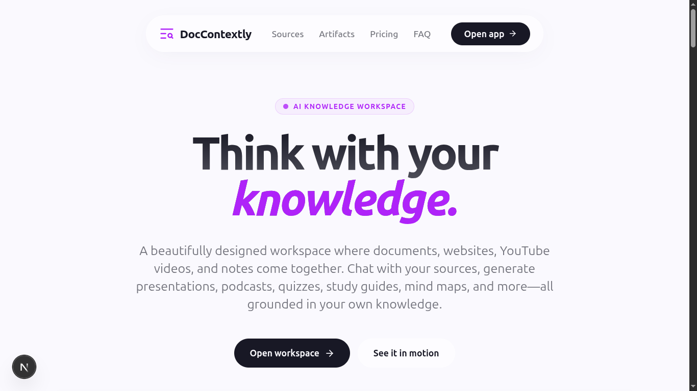


</div>

---

## Why DocContextly

Research and studying usually means bouncing between a dozen PDFs, browser tabs, YouTube videos, and a separate AI chat tool — with no shared context between them.

DocContextly puts everything in one notebook. Upload your sources once, and:

- **Ask questions** and get answers grounded only in what you uploaded — not the model's general knowledge
- **Generate study material** — quizzes, flashcards, mind maps, study guides — automatically
- **Produce shareable output** — slide decks (export to PDF/PPTX) and podcast-style audio overviews

No more re-explaining context to a chatbot or manually building slides from your notes.

---

## 🚧 Project Status

Core functionality is complete and working end-to-end. Current focus: production deployment, performance tuning, and testing.

| Area | Status |
|---|---|
| Multi-source ingestion (PDF, DOCX, CSV, MD, web, YouTube) | ✅ Done |
| RAG-based chat | ✅ Done |
| Source preview system | ✅ Done |
| Summary / FAQ / Quiz / Flashcard / Study Guide generation | ✅ Done |
| Mind map generation | ✅ Done |
| Slide deck generation (multi-theme, exportable) | ✅ Done |
| Podcast-style voiceover generation | ✅ Done |
| Redis + ARQ background workers | ✅ Done |
| Vector search with Qdrant | ✅ Done |
| Production deployment | 🔄 In progress |
| Performance optimization | 🔄 In progress |
| End-to-end testing | 🔄 In progress |

---

## ✨ Features

### 📂 Multi-Source Knowledge Base

Bring in content from PDFs, DOCX, CSV, Markdown, plain text, websites, blog articles, and YouTube videos — or just give it a topic and let DocContextly research it for you (search the web → find sources → extract content → build the notebook automatically).

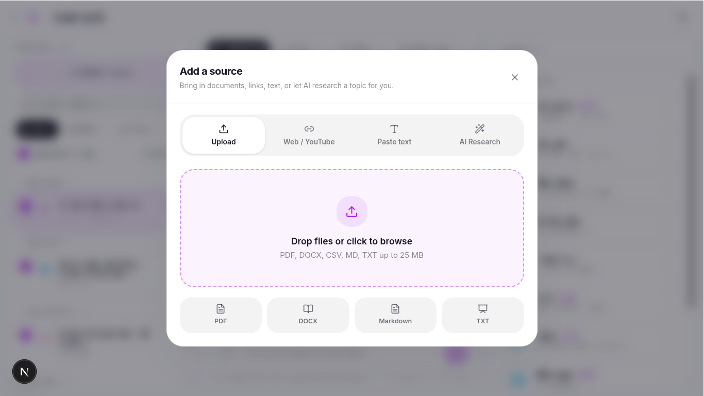

### 📖 In-App Source Preview

Every source type previews directly in the app — no downloading, no switching tools.

| PDF | DOCX | CSV | Markdown / Text | Website | YouTube |
|---|---|---|---|---|---|
| ✅ | ✅ | ✅ | ✅ | ✅ | ✅ (+ transcript) |

YouTube sources include embedded video playback alongside full transcript extraction, and website/blog sources are rendered as clean, readable content rather than raw HTML.

| PDF | CSV | YouTube |
|---|---|---|
| 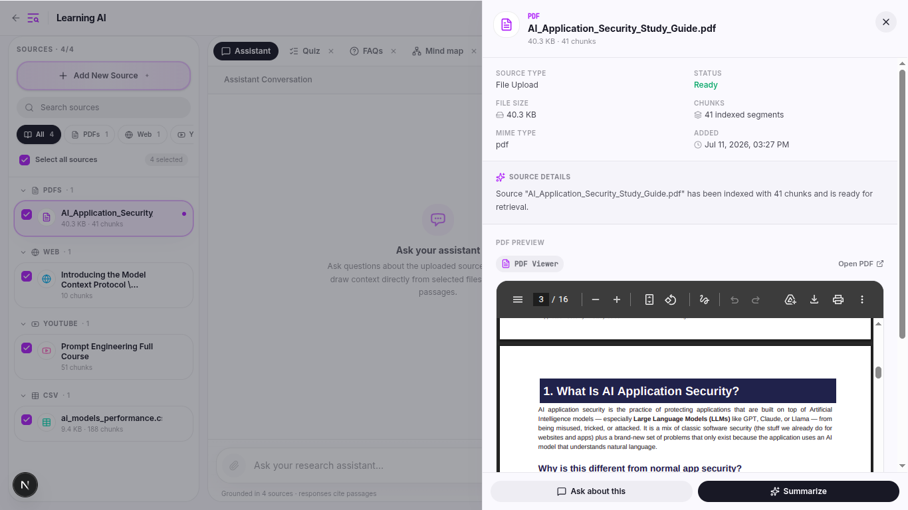 | 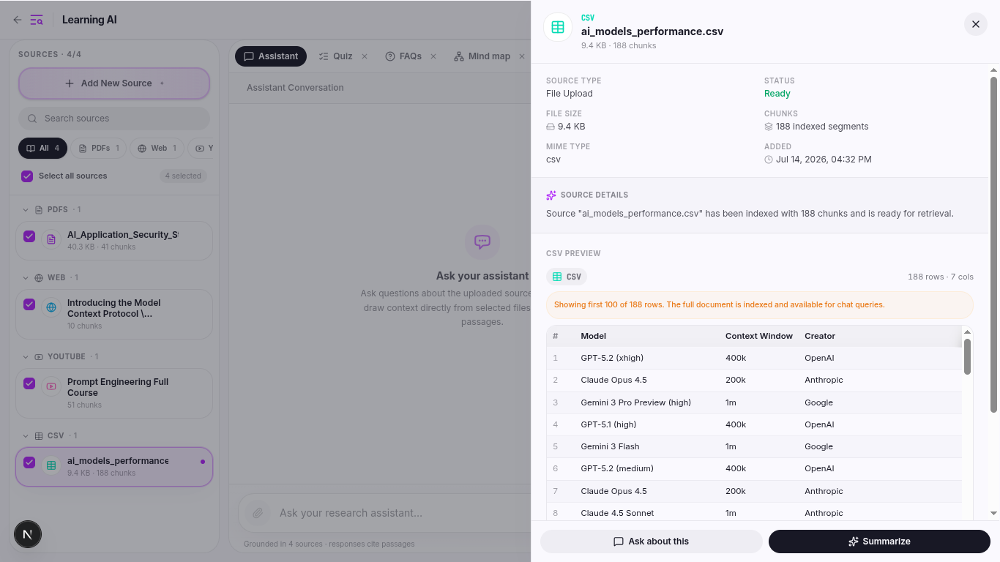 | 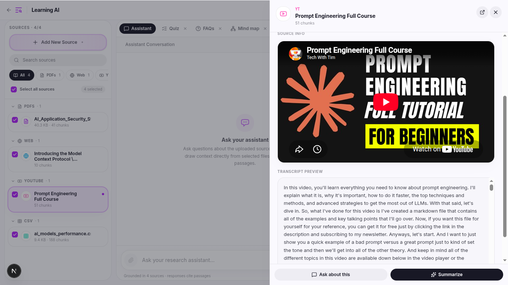 |

*(DOCX, Markdown/text, and website previews follow the same in-app pattern — screenshots coming as the UI is finalized.)*

### 💬 AI Chat (RAG-Grounded)

Ask questions across one or many sources at once. Answers are generated via Retrieval-Augmented Generation, so responses are grounded in your actual documents — with source selection, multi-document context, and reduced hallucinations built in.

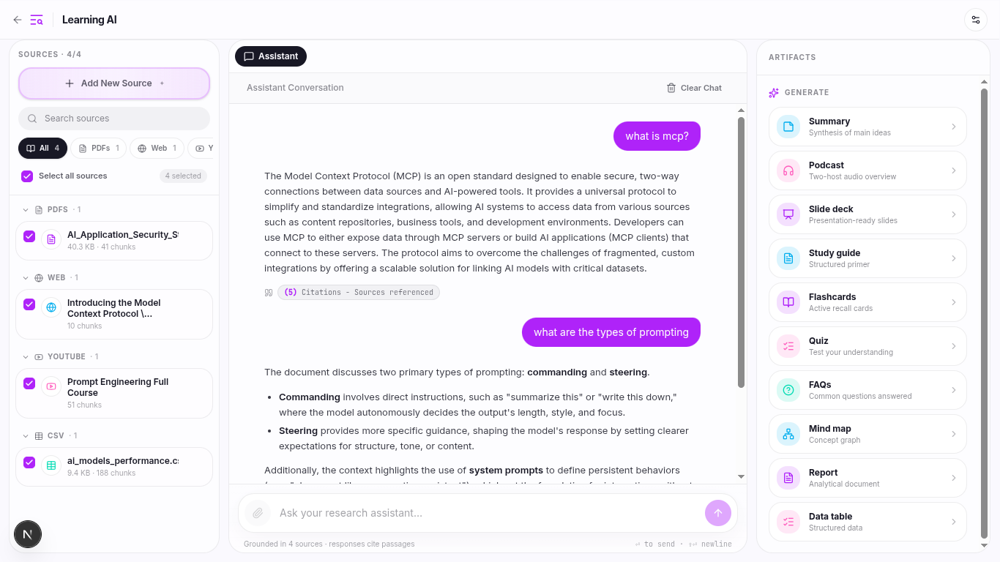

### 🧠 AI Artifacts

Turn any notebook into study or presentation material, regenerable anytime with different prompts.

**Visual / interactive:**

| Artifact | Description |
|---|---|
| 📊 **Slide Decks** | Multi-theme, responsive, images/icons included, presentation mode, export to PDF/PPTX |
| 🎙 **Podcast-Style Voiceovers** | Multi-speaker, AI-scripted, source-grounded audio |
| 🧩 **Mind Maps** | Visualize concepts and relationships |
| 🎯 **Quizzes** / 🗂 **Flashcards** | Self-assessment and active recall |

<table>
<tr>
<td>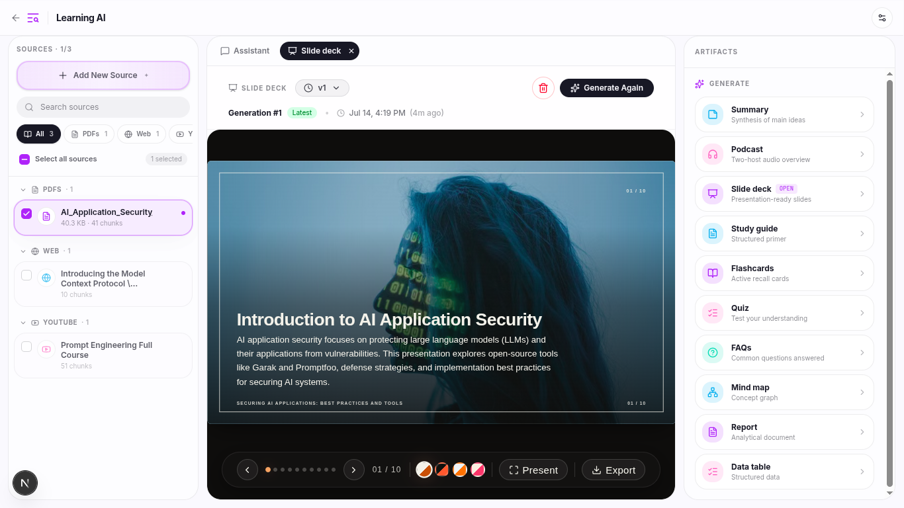</td>
<td>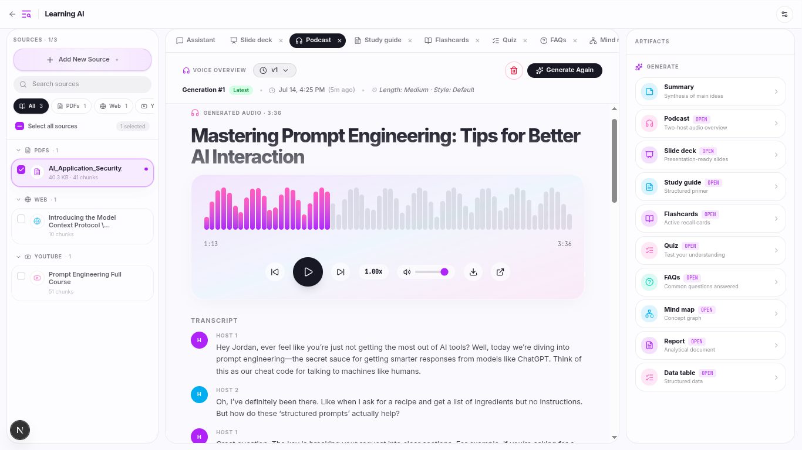</td>
</tr>
<tr>
<td>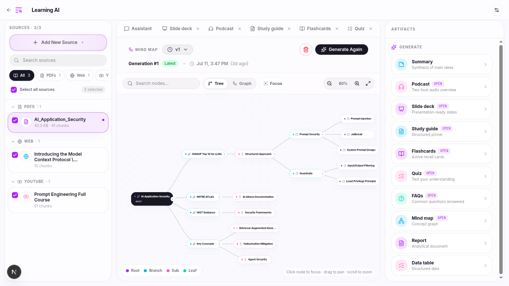</td>
<td>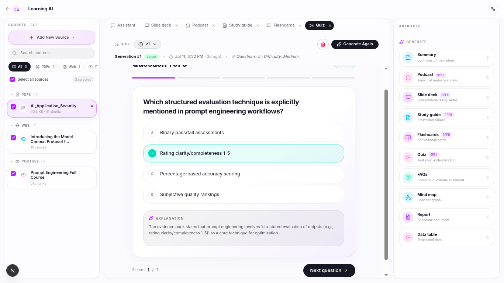</td>
</tr>
</table>

**Structured text output:**

- 📝 **Summaries** — concise or detailed
- ❓ **FAQs** — auto-generated question/answer pairs
- 📚 **Study Guides** — structured breakdowns for review
- 📑 **Reports** — longer-form written output
- 🗃 **Data Tables** — tabular extraction from source content

<table>
<tr>
<td>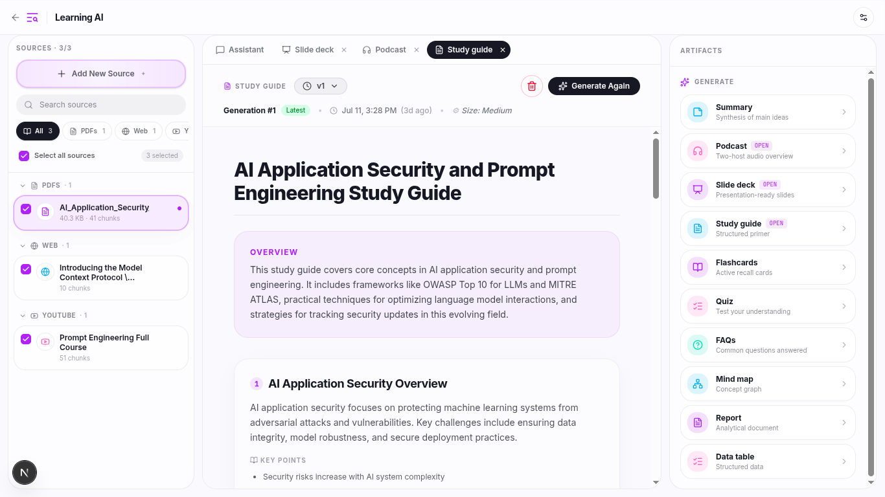</td>
<td>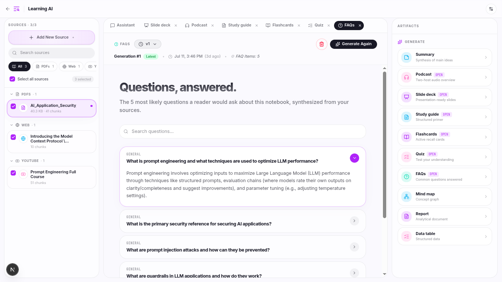</td>
</tr>
</table>

---

## ⚡ Background Processing

AI generation (slide decks, voiceovers, etc.) runs asynchronously so the app stays responsive while you keep working. Built with Redis, ARQ workers, a background job queue, retry mechanisms, and idempotent jobs.

---

## 🏗 Architecture

```text
                        ┌──────────────┐
                        │     User     │
                        └──────┬───────┘
                               ▼
                  ┌────────────────────────┐
                  │   Next.js Frontend     │
                  └──────────┬─────────────┘
                             ▼
                  ┌────────────────────────┐
                  │   FastAPI Backend      │
                  └──────────┬─────────────┘
                             │
        ┌────────────────────┼────────────────────┐
        ▼                    ▼                    ▼
┌───────────────┐  ┌────────────────┐  ┌────────────────┐
│  PostgreSQL   │  │  Redis + ARQ   │  │ Image Storage  │
│  Metadata DB  │  │ Background Jobs│  │ Source Assets  │
└───────────────┘  └────────────────┘  └────────────────┘
                             │
                             ▼
                  ┌────────────────────────┐
                  │  AI Processing Layer   │
                  └──────────┬─────────────┘
                             ▼
               ┌─────────────────────────────┐
               │      Qdrant Vector DB       │
               │ Embeddings + Semantic Search│
               └─────────────────────────────┘
```

**Pipeline:** Add sources → extract & clean content → chunk → generate embeddings → store in Qdrant → retrieve relevant chunks per query → LLM generates grounded responses and artifacts.

---

## 🛠 Tech Stack

| Layer | Technologies |
|---|---|
| **Frontend** | Next.js, React, TypeScript, Tailwind CSS, TanStack Query, shadcn/ui |
| **Backend** | FastAPI, Python, SQLAlchemy, Alembic, PostgreSQL, Pydantic |
| **AI / ML** | LangChain, RAG, Hugging Face Embeddings, Qdrant, LLMs |
| **Background Jobs** | Redis, ARQ |
| **Storage** | ImageKit, Cloud Object Storage |

---

## 🚀 Getting Started

### Clone

```bash
git clone https://github.com/mrehanamjad/DocContextly-AI-notebooklm-clone.git
cd doccontextly
```

### Backend

```bash
cd backend
python -m venv .venv
source .venv/bin/activate
pip install -r requirements.txt

alembic upgrade head
uvicorn app.main:app --reload
```

### Background Worker

```bash
arq app.worker.main.WorkerSettings
```

### Frontend

```bash
cd frontend
npm install
npm run dev
```

---

## 🎯 Technical Highlights

- **RAG pipeline** — semantic search over vector embeddings, multi-source retrieval, grounded responses that reduce hallucination
- **Async background workers** — non-blocking AI generation with retry support and idempotent jobs, built for scale
- **Vector search** — Qdrant-backed semantic similarity search with metadata filtering for fast, relevant retrieval

---

## 👨‍💻 Author

**Muhammad Rehan Amjad**